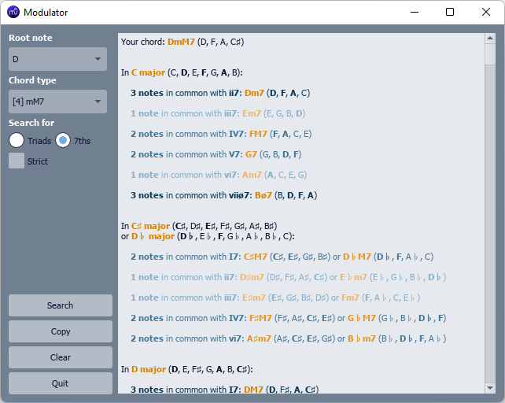

# Modulator plugin for MuseScore 4
Looking for **Modulator for MuseScore 3** ? It's [here](https://github.com/madjyc/Modulator_MuseScore3).

**Choose a single note or a chord, then let the plugin find all the chords (triads or seventh chords) in all keys and scales that share at least 1 note with it** (see "Hints" below).

## Installation
1.  Download the plugin as a .zip file (click on the green <kbd>Code</kbd> button at the top of this page, then on <kbd>Download ZIP</kbd>).
2.  Unzip it in the **MuseScore4/Plugins** folder (in **Documents** by default).
3.  Launch MuseScore.
4.  Enable Modulator in the **Plugins** menu (under **Home**, left-hand column).

## Usage
1. Launch MuseScore.
2. Open a score.
3. Run Modulator from the **Plugins > Composing/arranging tools** menu.
4. Select the root note and type of the chord (or single note) you want to submit.
   Check **Triads** if you want to search for triads, or **7ths** if you want to search for seventh chords.
   Check **Strict** if you want the results to include all the notes of your chord, uncheck if you want the results to include at least 1 note from your chord.
5. Click on the <kbd>Search</kbd> button.

## Tests
Tested on MuseScore 4.0.1.

## Hints
**Harmonizing a melody line**
  - Select one note from the melody you want to harmonize, select **[1] single note** as the chord type, check either **Triads** or **7ths** (it doesn't matter whether you check or not **Strict** in case of a "single-note chord"), then press the <kbd>Search</kbd> button. You will be presented with all chords from all keys/scales that include the selected note. All those chords could be used to harmozize the selected note (and possibly modulate to a different key/scale in the process).
  - For a 2-note counterpoint melody, select both notes as a 2-note chord (choosing the lowest as the root note), check either **Triads** or **7ths**, check **Strict**, then press the <kbd>Search</kbd> button.

**Pivot-chord modulation** (see "Pivot-chord modulation" http://elliotthauser.com/openmusictheory/Modulation.html)
  - To modulate using a ***pivot chord***, select the root note and type of chord you want to use as a "pivot", check either **Triads** or **7ths**, check **Strict**, then press the <kbd>Search</kbd> button. You will be presented with all chords from all keys/scales that share the selected notes. If you only want to consider, say, a ***subdominant function***, sift through the results looking for a **IV** or **iv** (see "Extended Pivot Chord Modulation" below).

**Common-tone modulation** (see "Common-Tone Modulation" at https://viva.pressbooks.pub/openmusictheory/chapter/reinterpreting-augmented-sixth-chords/)
  - To modulate using a ***common-tone***, select the one note you want to keep in the original chord as a **[1] single note** type of chord, check either **Triads** or **7ths**, then press the <kbd>Search</kbd> button. You will be presented with all chords from all keys/scales that share the selected note (e.g. "chromatic mediants").

**Extended pivot-chord modulation via "mode mixture"** (see "Chromatic Modulation" at https://viva.pressbooks.pub/openmusictheory/chapter/reinterpreting-augmented-sixth-chords/)
  - For instance, let's say we start in A♭ major with a Fm chord (vi). Enter **F** as the root note and **[3] m** as the type of chord, check **Triads** and **Strict**, then press the <kbd>Search</kbd> button. Sift through the results to C natural minor which has the same Fm chord as (iv). Using Fm as a ***pivot chord***, you could already modulate to C natural minor, but let's investigate its parallel key C major instead. C major is not listed as it doesn't include Fm, but if we run another <kbd>Search</kbd> with **Strict** unchecked, we find that C major has a closely related F chord (IV). Considering the keys of C major and C natural minor as a "mixture", we have found a way to modulate from A♭ major directly to C major, by using a F chord borrowed from C natural minor as a ***pivot chord***.

We hope you will find many other uses for this plugin. Enjoy!
